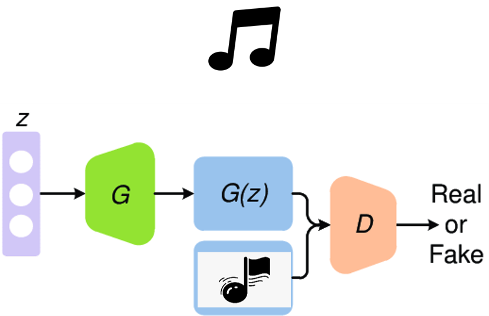
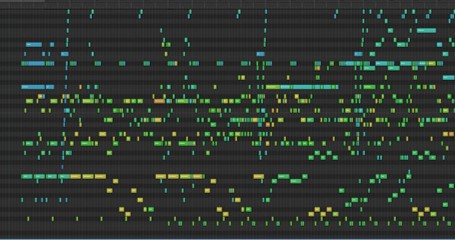

# MusicGAN - End to End Music Generation using MIDI notes and Chords

> End-to-end music generation using GANs, leveraging a MIDI dataset with 174K+ datapoints. Through preprocessing and deep learning, the model converts MIDI to images, trains a GAN architecture, and produces harmonious, AI-generated music. 🎵
- **NOTE:** At any point in the project, the Powerpoint presentation attached could be referred to, for any conceptual understanding about MIDI Files, the preprocessing, GAN model and it's training, etc.

# **Project Overview**
This project delves into the realm of music generation, employing Generative Adversarial Networks (GANs) on a substantial MIDI dataset. By extracting musical features from MIDI files, converting them to images, and employing a GAN architecture, the aim is to create an end-to-end system capable of autonomously composing harmonious music. The integration of deep learning techniques not only facilitates the transformation of musical notation into visual representations but also enables the generation of novel musical compositions that extend beyond traditional human creativity. The repository provides a comprehensive understanding of the dataset, preprocessing steps, GAN architecture, loss functions, and showcases the results, emphasizing the fusion of art and technology in the realm of music.



## Python Packages Used
In this section, I include all the necessary dependencies needed to reproduce the project, so that the reader can install them before replicating the project. I categorize the long list of packages used as - 
- **General Purpose:** `os, shutil, glob, tqdm, IPython`
- **Data Manipulation:** `numpy, PIL, imageio, music21`
- **Data Visualization:** `matplotlib`
- **Machine Learning:** `keras, tensorflow`

## Installation
### Prerequisites
> **Make sure you have the following prerequisites installed:**
- **music21**
- **fluidsynth**
- You can install them using the following commands:

```
!pip install music21
!apt install fluidsynth
```

## Downloading the Dataset
- Download the Lakh MIDI Clean dataset using Kaggle API. Make sure you have a Kaggle account and API key.

```
!pip install -q kaggle
!mkdir ~/.kaggle
!cp kaggle.json ~/.kaggle/
!chmod 600 ~/.kaggle/kaggle.json
!kaggle datasets download -d imsparsh/lakh-midi-clean
```

## Extracting Dataset
- Extract the downloaded dataset to the project folder.

```
!mkdir "/content/LAKH-MIDI-CLEAN-DATASET/"
!unzip "lakh-midi-clean.zip" -d "/content/LAKH-MIDI-CLEAN-DATASET/lakh_midi_clean"
```



## Setup
### Setting Up SoundFont for FluidSynth
- Copy the SoundFont file for FluidSynth.

```
!cp /usr/share/sounds/sf2/FluidR3_GM.sf2 ./font.sf2
```

### Loading Required Libraries
- Install and import the necessary Python libraries.

```
!pip install numpy imageio pillow matplotlib tqdm tensorflow
```

## Running GAN Model
- Execute the GAN model for music generation.
- Save the file in `output.wav`

```
!fluidsynth -ni font.sf2 composition.mid -F output.wav -r 44100
```


## Displaying Audio
- Display the generated audio within the notebook.

```
from IPython.display import Audio
Audio('output.wav')
```

> Ensure all dependencies are correctly installed and configured before running the project. Adjust paths and configurations as needed for your environment.

## Results and evaluation
- [Example Output 1 Generated by MusicGAN](assets/output_1.mid)
- [Example Output 2 Generated by MusicGAN](assets/output_2.mid)
- [Example Output 3 Generated by MusicGAN](assets/outptu_3.mid)


# License
For this github repository, the License used is [MIT License](https://opensource.org/license/mit/).


